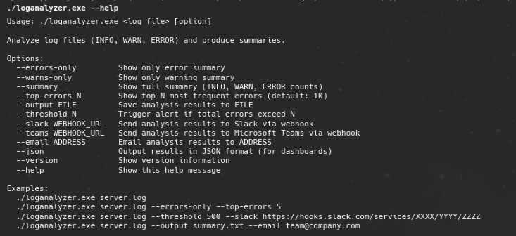
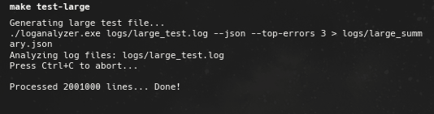
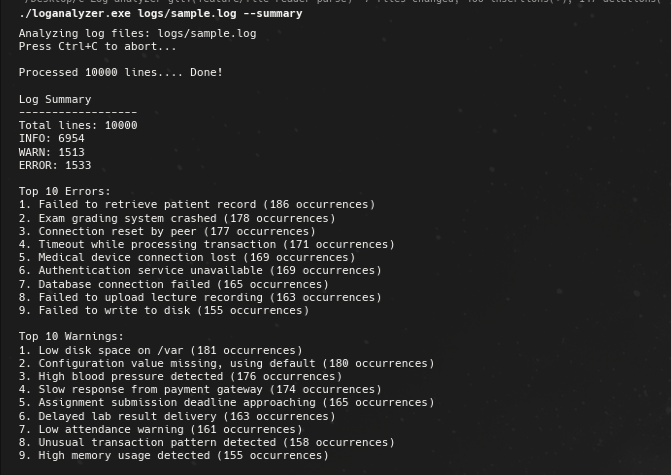
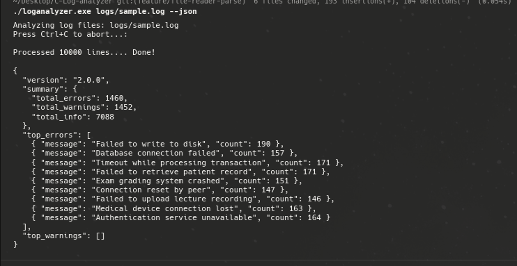
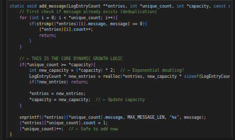
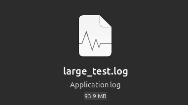
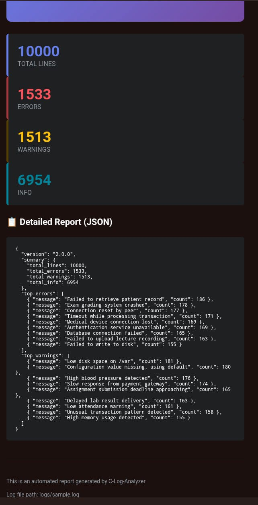

# C Log Analyzer

A powerful, fast command-line tool for analyzing log files written in C. Features dynamic error/warning aggregation, intelligent pattern interpretation, JSON export, and automated email reporting.

## ⚡ Quick Start

```bash
make clean && make                              # Build
python3 logs/generate_logs.py                   # Generate sample log (10K lines)
./loganalyzer.exe logs/sample.log --summary     # Analyze with full summary
./automation.sh email-html logs/sample.log you@example.com  # Email HTML report
```

## 🎯 Features

- 📊 **Dynamic Analysis** - Automatically aggregates and ranks errors/warnings by frequency
- 🧠 **Smart Interpretation** - Pattern matching for database, timeout, disk, memory, auth issues
- 📄 **JSON Export** - Machine-readable output for dashboards and automation
- 📧 **Email Reports** - Beautiful HTML or plain text JSON reports via msmtp
- ⚡ **High Performance** - Processes 1M lines in ~5 seconds
- 🎨 **Color Output** - ANSI-colored terminal display

---

## 🖼️ Visual Walkthrough

These screenshots show the main user flow and key outputs.

### 1) CLI help and entry points

Use this to discover supported flags and common commands.



### 2) Running analysis from terminal

Example of executing the analyzer on a log file in a terminal session.



### 3) Terminal summary output

Human-readable summary including totals and top recurring issues.



### 4) JSON output for automation

Machine-readable output used for pipelines, dashboards, and integrations.



### 5) Dynamic growth behavior in analyzer

Reference view related to dynamic capacity growth for unique entries.



### 6) Large-file stress test

Validation run against very large logs to confirm performance and stability.



### 7) Email reporting output

Sample delivered email report generated from analyzer output.



---

## 🔧 Installation

### Requirements

- GCC (C99 standard)
- Python 3 (for log generation)
- msmtp (for email functionality - optional)

### Build

```bash
make              # Compile
make clean        # Remove obj/*.o, executable, logs/*.{txt,log,json}
```

⚠️ **Note:** `make clean` deletes all log files including `sample.log`. Regenerate with `python3 logs/generate_logs.py`

---

## 💻 Usage

### Generate Test Logs

```bash
# Small sample (10K lines - healthcare, finance, edu, IT logs)
python3 logs/generate_logs.py

# Large stress test (1M lines)
make test-large
```

### Basic Analysis

```bash
# Quick analysis
./loganalyzer.exe logs/sample.log

# Detailed summary with interpretations
./loganalyzer.exe logs/sample.log --summary

# Errors only, top 15
./loganalyzer.exe logs/sample.log --errors-only --top-errors 15

# Warnings only
./loganalyzer.exe logs/sample.log --warns-only
```

### JSON Export

```bash
# JSON output (for automation/dashboards)
./loganalyzer.exe logs/sample.log --json

# Save to file (suppress progress messages)
./loganalyzer.exe logs/sample.log --json > report.json 2>/dev/null

# Pretty print
./loganalyzer.exe logs/sample.log --json | python3 -m json.tool

# Batch process all logs
./automation.sh batch-json
```

### Analysis Flags

- `--help` - Show help and examples (`./loganalyzer.exe --help`)
- `--summary` - Full detailed summary (`./loganalyzer.exe file.log --summary`)
- `--errors-only` - Show only error stats (`./loganalyzer.exe file.log --errors-only`)
- `--warns-only` - Show only warning stats (`./loganalyzer.exe file.log --warns-only`)
- `--json` - JSON format output (`./loganalyzer.exe file.log --json`)
- `--top-errors N` - Top N errors (default: 10) (`./loganalyzer.exe file.log --top-errors 20`)

---

## 📧 Email Reports

### How Email Reports Work

**The Flow:**

1. **Analyzer** (`loganalyzer.exe`) reads your log file and generates JSON output
2. **automation.sh** extracts data from JSON and formats it (HTML or plain JSON)
3. **msmtp** sends the formatted report to the recipient email address
4. **Gmail SMTP** (configured in `~/.msmtprc`) delivers the email

**Three ways to send:**

**Option 1: Direct automation.sh call (most control)**

```bash
./automation.sh email-html logs/sample.log alice@gmail.com          # Top 10 (default)
./automation.sh email-html logs/sample.log alice@gmail.com 20       # Top 20
./automation.sh email-json logs/sample.log team@company.com 15      # JSON format
```

**Option 2: Makefile targets (convenient, with defaults)**

```bash
make email-html                                    # Uses defaults (fails - team@company.com is placeholder)
make email-html EMAIL=alice@gmail.com              # HTML to alice
make email-html EMAIL=ops@company.com TOP=20       # HTML to ops with top 20 errors
make email-report EMAIL=admin@company.com TOP=15   # JSON to admin
```

**Option 3: Manual pipe (advanced)**

```bash
./loganalyzer.exe logs/sample.log --json | msmtp -a gmail alice@gmail.com
```

### Manual Email (Direct Pipe)

```bash
./loganalyzer.exe logs/sample.log --json | msmtp -a gmail user@example.com
```

### Email Setup (msmtp)

1. Install: `sudo apt install msmtp msmtp-mta`
2. Configure `~/.msmtprc`:

```conf
account gmail
host smtp.gmail.com
port 587
from your-email@gmail.com
user your-email@gmail.com
password your-app-password
auth on
tls on
tls_trust_file /etc/ssl/certs/ca-certificates.crt

account default : gmail
```

1. Set permissions: `chmod 600 ~/.msmtprc`
2. Test: `echo "test" | msmtp -a gmail your-email@gmail.com`

---

## ⏰ Automation

### Makefile Targets

- `make` - Compile project (output: `loganalyzer.exe`)
- `make clean` - Remove build artifacts and logs (`obj`, executable, `logs/*`)
- `make run` - Analyze `logs/sample.log` and print summary
- `make test-large` - Generate and analyze 1M lines (`logs/large_test.log`, `logs/large_summary.json`)
- `make valgrind` - Run memory leak checks
- `make daily-summary` - Generate `logs/daily_summary.json`
- `make automate-batch` - Generate batch JSON outputs for all `logs/*.log`
- `make email-html [EMAIL=user@example.com] [TOP=10] [LOG=logs/sample.log]` - Send HTML report via msmtp
- `make email-report [EMAIL=user@example.com] [TOP=10] [LOG=logs/sample.log]` - Send JSON email report via msmtp

**Configurable Email Targets** - EMAIL parameter is **required** for actual delivery:

⚠️ **Important:** The `EMAIL=` parameter is where you specify the **real recipient email address**. The default `team@company.com` in the Makefile is just a placeholder.

```bash
# Send HTML report to alice@gmail.com (her email)
make email-html EMAIL=alice@gmail.com

# Send to ops team with top 20 errors from production log
make email-html EMAIL=ops@company.com TOP=20 LOG=logs/production.log

# Send JSON report to admin
make email-report EMAIL=admin@company.com TOP=15 LOG=logs/app.log

# Batch process all logs (no email, just local JSON files)
make automate-batch
```

**What happens when you run the command:**

1. User types: `make email-html EMAIL=alice@gmail.com`
2. Make substitutes variables: `./automation.sh email-html logs/sample.log alice@gmail.com 10`
3. automation.sh extracts JSON from analyzer
4. msmtp sends the report to `alice@gmail.com` via Gmail SMTP (configured in ~/.msmtprc)

⚠️ **Integration Targets** (require webhook URL configuration in Makefile):

- `make slack-alert` - Send to Slack (configure webhook)
- `make teams-alert` - Send to Teams (configure webhook)
- `make threshold-alert` - Conditional Slack alert if errors > 500
- `make dashboard-export` - Copy JSON to `/var/monitoring/`

---

## 📋 Command Reference

### Common Workflows

**Development Testing:**

```bash
make clean && make
python3 logs/generate_logs.py
./loganalyzer.exe logs/sample.log --summary --top-errors 15
```

**Production Analysis:**

```bash
./loganalyzer.exe /var/log/app.log --json > analysis.json 2>/dev/null
./automation.sh email-html /var/log/app.log ops@team.com 30
```

**Batch Processing:**

```bash
./automation.sh batch-json
ls -lh logs/*_output.json
```

### Output Formats

**Terminal Summary:**

- Total lines, error/warning/info counts
- Top 10 errors/warnings by frequency
- Dominant pattern identification
- Intelligent interpretation (database issues, timeouts, disk, memory, auth failures)

**JSON Schema:**

```json
{
  "total_lines": 10000,
  "total_errors": 450,
  "total_warnings": 230,
  "total_info": 9320,
  "unique_errors": 8,
  "unique_warnings": 5,
  "top_errors": [
    {"message": "Database connection failed", "count": 125}
  ],
  "top_warnings": [
    {"message": "High memory usage detected", "count": 67}
  ]
}
```

### Expected Log Format

```text
YYYY-MM-DD HH:MM:SS LEVEL Message text
```

**Examples:**

```text
2026-03-02 10:15:32 ERROR Database connection failed
2026-03-02 10:15:33 WARN Retrying connection...
2026-03-02 10:15:35 INFO Connection established
```

---

## ⚙️ Configuration

### Makefile Integrations

Edit [Makefile](Makefile) to configure webhooks:

**Slack (line ~67):**

```makefile
https://hooks.slack.com/services/YOUR/WEBHOOK/HERE
```

**Teams (line ~73):**

```makefile
https://outlook.office.com/webhook/YOUR/WEBHOOK/HERE
```

**Dashboard Export (line ~85):**

```makefile
/var/monitoring/logs_summary.json  # Ensure write permissions
```

---

## 🔍 Troubleshooting

**Q: `make clean` deleted my sample.log!**
A: Regenerate with `python3 logs/generate_logs.py`

**Q: JSON output has extra text mixed in**
A: Suppress progress messages: `./loganalyzer.exe file.log --json 2>/dev/null`

**Q: Email not sending**
A: Test msmtp config: `msmtp --serverinfo --account=gmail`

**Q: Permission denied for dashboard-export**
A: `sudo mkdir -p /var/monitoring && sudo chown $USER /var/monitoring`

**Q: Valgrind shows memory leaks**
A: Check "definitely lost" should be 0 bytes. "Still reachable" is normal for dynamic arrays.

**Q: Makefile integrations not working**
A: Configure webhook URLs in Makefile before using `make slack-alert`, etc.

---

## 📁 Project Structure

```text
C-Log-analyzer/
├── public/                  # README screenshots and visual references
│   ├── log-analyzer-help-output.png
│   ├── terminal-log-test-file-terminal.png
│   ├── log-analyzer-terminal-summary.png
│   ├── log-output-json-format.png
│   ├── dynamic-growth-implementation.png
│   ├── large-test-log-file-2M-lines.png
│   └── email-send-loganalyzer.jpeg
├── src/                     # C source files
│   ├── main.c              # Entry point, CLI arg parsing
│   ├── analyzer.c          # Core analysis logic, aggregation
│   ├── parser.c            # Log line parsing
│   ├── report.c            # Output formatting, interpretations
│   └── file_reader.c       # File I/O operations
├── include/                 # Header files
│   ├── analyzer.h          # AnalysisResult, LogEntryCount structs
│   ├── parser.h            # LogEntry struct
│   ├── report.h            # Report function declarations
│   └── file_reader.h       # File reading functions
├── obj/                     # Compiled object files (created by make)
├── logs/                    # Log files and JSON outputs
│   ├── generate_logs.py    # Python script to generate sample.log
│   └── *.log, *_output.json, *_progress.log
├── Makefile                 # Build configuration
├── automation.sh             # Unified script: batch-json, email-json, email-html
└── README.md                # This file
```

---

## 🤝 Contributing

Contributions welcome! Please ensure:

- Code follows C99 standard
- Compiles without warnings (`-Wall -Wextra`)
- Includes comments for complex logic
- Tests pass (`make test-large` + `make valgrind`)

---

## 📄 License

This project is open source. See LICENSE file for details.

---

**Version:** 1.0 | **Last Updated:** March 2, 2026 | **Author:** C-Log-analyzer Team
